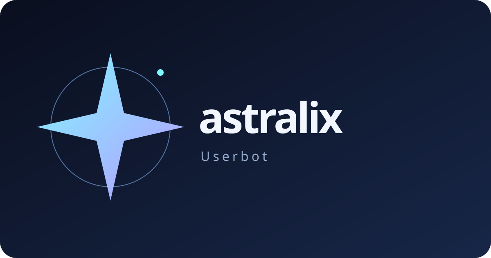

<div align="center">

</div>

# astralix Userbot

Telegram userbot with **astralix-tl** installed from `lowsense-dev/astralix-tl` on GitHub. Installing dependencies requires Git access to that private repository.
Project repository: **lowsense-dev/astralix** (private). There are no project Telegram channels or support chats.

## Install from the source directory

Install Python 3.10+ and uv, then run from this directory:

```bash
uv venv --python python3 .venv
uv pip install --python .venv/bin/python -r requirements.txt
.venv/bin/python -m astralix --no-git
```

The `--no-git` option is required for an archive checkout. Dependencies are installed explicitly; starting the application does not install or update packages. Optional dependencies:

```bash
uv pip install --python .venv/bin/python -r optional_requirements.txt
```

Explicit module installation and explicit application updates may install dependencies through uv. Third-party modules execute with the same privileges as the userbot; review their source before loading them.

Login uses the RU/EN web interface by default. Pass `--no-web` for interactive console login.

Existing Heroku data is not automatically renamed: keep its backup and use a separate data directory for the rebranded application until migration is reviewed.

## Development

```bash
uv pip check --python .venv/bin/python
```

See [upstream attribution](THIRD_PARTY_NOTICES.md). The userbot retains its AGPL-3.0 license; the separately installed Telegram library retains its MIT license.
