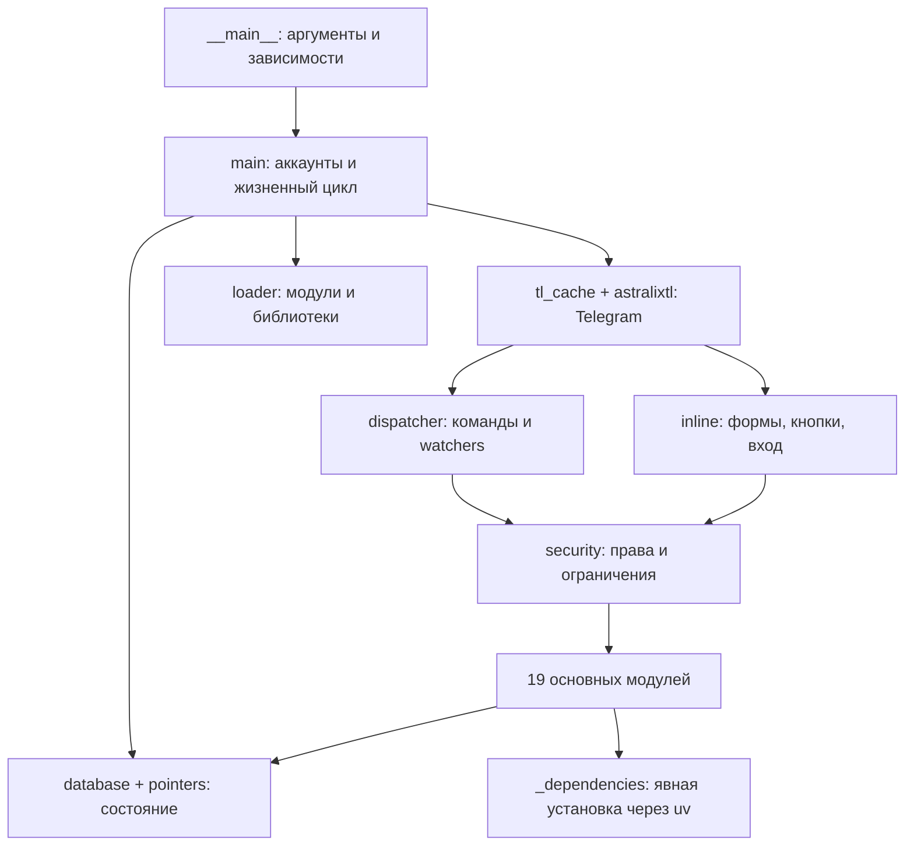

# Анализ astralix Userbot

Дата: 2026-09-26. Объект: локальный проект `/home/kat/Projects/astralix`; библиотека `/home/kat/Projects/astralix-tl`.

## Объём и метод

Проиндексированы все 70 Python-файлов приложения (33,520 строк), 9 langpack, скрипты установки, Docker и CI. Выполнены AST-проверки, Ruff, Bandit, аудит установленных зависимостей, проверка импорта всех 19 основных модулей и регрессионные тесты. Углублённо рассмотрены границы авторизации, загрузка исполняемого кода, обновления, вход, секреты, бэкапы и хранение состояния. Встроенная библиотека рассматривалась отдельно: транспорт, аутентификация, сессии, загрузки и сборка.

Это полный статический проход и разбор архитектуры, а не утверждение, что каждая строка доказана корректной или найдены все уязвимости. Ни Docker, ни настоящий Telegram-вход, ни отправка сообщений не запускались. Реестр всех файлов и их структурных элементов: [CODE_INVENTORY.md](CODE_INVENTORY.md).

## Архитектура

### Основные подсистемы

| Подсистема | Назначение и результат анализа |
|---|---|
| `__main__`, `main`, `configurator` | Проверка среды, CLI, сессии, несколько аккаунтов. Установка зависимостей при старте удалена. `main` создаёт экземпляр приложения при импорте — это источник циклических импортов и осложнение тестирования. |
| `loader`, `types`, `modules/loader` | Динамическая загрузка Python, библиотеки, конфигурация и lifecycle. Это исполнение доверенного кода с правами процесса, а не песочница. Проверка требований не делает модуль безопасным. |
| `dispatcher`, `security`, `_event_filters` | Маршрутизация, маски прав, владельцы, адресные правила и фильтры. По умолчанию команды доступны владельцу. Исправлены неверные фильтры групп и редактируемых сообщений. |
| `inline/*` | Telegram UI, callbacks, inline queries, формы и галереи. Случайные идентификаторы используют `secrets`. Основной диспетчер проверяет права; вход дополнительно привязан к конкретному актору. |
| `astralix_web`, `_login` | Название web историческое: здесь вход через Telegram inline, не HTTP-сервер. Добавлены TTL, сериализация и закрытие временных клиентов. |
| `database`, `pointers`, `_local_storage` | JSON/Redis, коллекции с сохранением, кэш модулей. Запись приватных файлов атомарная. Исправлен подсчёт UTF-8 байтов в кэше и перезапись возле лимита. |
| `astralix_backup`, `_backup` | Создание и восстановление БД/модулей. Добавлены пределы ZIP и предварительная проверка; бэкап с Python-модулями остаётся источником исполняемого кода. |
| `updater`, `utils/git` | Обновление, changelog, рестарт и откат. Откат теперь проверяет exit code до рестарта. Фоновый git fetch вынесен из event loop. |
| `log`, `_internal`, `test` | Логи, редактирование секретов, приватные файлы и диагностика. Redaction уменьшает утечки, но не может распознать любой неизвестный секрет. |
| `eval`, `terminal` | Намеренное исполнение команд владельца. `_SecureDB` и список опасных shell-строк не являются изоляцией от произвольного Python/shell-кода. |
| `translations`, `langpacks` | YAML через safe loader, локальные/внешние переводы. Исправлена сборка многоязычного словаря; статические ключи модулей сверены с EN/RU. |
| `astralix_config`, `settings`, `astralix_settings` | Изменение конфигурации, настройки команд и inline-формы. Большие методы усложняют review; предпочтительно дальнейшее разделение по функциям. |
| `help`, `astralix_info`, `quickstart`, `inline_stuff` | Информация и onboarding. Обновлён бренд, удалена реклама каналов/хостинга; quickstart больше не выбирает канал только по названию. |
| `translate` | По умолчанию перевод Telegram; Google отправляет текст внешнему провайдеру и использует deep-translator. |
| `api_protection`, `loader_restrictor` | Ограничение API и ознакомительный тест перед модулями. Это защитные UX-механизмы, не средство изоляции вредоносного кода. |
| `tl_cache`, `secure/*` | Расширения клиента и специальный незашифрованный Unix proxy. Proxy выключен по умолчанию, требует явной переменной и сокета владельца с закрытыми правами. |
| `utils/*`, `validators`, `qr`, `_reference_finder` | Форматирование, разбор аргументов, платформенные данные, QR, validators и совместимость. Глобальный import hook и изменение ссылок усложняют сопровождение. |

## Подтверждённые исправления этого прохода

| Проблема | Что изменено |
|---|---|
| Неверная зависимость `astralix-TL-New` | Импорт `astralixtl` сопоставлен с локальными исправленными исходниками, а не несуществующим/чужим PyPI-именем. |
| Остатки ребрендинга | Убраны H3r0ku, HikkaPluginSecurity и реклама HikkaHost из langpack/меню; удалён старый `.pyc`. |
| Канал, выбранный по совпадению заголовка | Quickstart использует общий путь проверки приватности и владения каналом. |
| ZIP без лимитов, применение БД до проверки модулей | Лимиты 100 MiB на архив/суммарную распаковку, 5 MiB на элемент, 1000 элементов; проверка путей/коллизий и всех данных до применения. Командный и callback-пути используют общий парсер. |
| Рестарт до завершения `git reset` | `create_subprocess_exec`, проверка аргумента, ожидание завершения, отказ от рестарта при ошибке. |
| Блокирующий fetch в poller | Перенесён в worker thread. |
| Ошибка `{dictionary}` при многоязычном YAML | Возвращается словарь языков; неверный тип верхнего уровня отклоняется. |
| Ошибочные `no_groups`, `only_groups`, `editable` | Фильтры отражают заявленную семантику, включая супергруппы. |
| Кэш измерял символы вместо байтов | Считается UTF-8 размер, учтён размер заменяемого файла. |
| Локальный логотип молча игнорировался | `set_avatar` читает локальный файл; HTTP-путь получил таймаут. |
| `install.sh` мог удалить существующий каталог | Теперь отказывается перезаписывать существующее назначение. |
| Недостижимый ответ `no_sudo` | Исправлен порядок ветвей CLI. |
| Известные проблемы в aiohttp/GitPython | Обновлены до 3.14.3 и 3.1.60. |

Предыдущие исправления библиотеки и входа подробно перечислены в [UV_AND_SECURITY.md](UV_AND_SECURITY.md). Они сохранены.

## Зависимости

Перед обновлением pip-audit выдал 60 записей для 3 пакетов; часть записей дублируется. После обновления осталась одна запись: `PYSEC-2022-252` для `deep-translator==1.11.4`. [Исходная запись PyPA](https://github.com/pypa/advisory-database/blob/main/vulns/deep-translator/PYSEC-2022-252.yaml) описывает захват аккаунта и заражённую 1.8.5, но содержит открытый диапазон `introduced: 1.8.5` без `fixed`. Поэтому флаг для 1.11.4 нельзя автоматически считать доказательством заражения или безопасно проигнорировать. Версия зафиксирована; требуется отдельная проверка происхождения дистрибутива либо замена Google-провайдера.

`astralix-tl` отсутствует в PyPI, поэтому pip-audit пропускает её. Это не означает отсутствие проблем: для неё применены source review и собственные тесты. Опциональные пакеты не устанавливались и этим запуском dependency audit не покрыты.

Установка управляется uv, но это схема `uv venv` + `uv pip install`, не `uv sync`: проект сохраняет requirements и пакеты пользовательских модулей. Полного lockfile и хешей всех транзитивных пакетов пока нет; воспроизводимость не абсолютная.

## Что остаётся ограничением

1. **Нужна интеграционная проверка Telegram.** Первичный вход, 2FA, account switch, BotFather, inline формы, восстановление и floodwait проверены без реальных RPC только в отдельных регрессионных сценариях.
2. **Старые данные не мигрируются автоматически.** Переименованы env-префиксы, ключи БД, имена модулей и файлов сессий. Перед переносом живого аккаунта необходима отдельная миграция с резервной копией. Алиасы Hikka/Telethon сохранены для совместимости.
3. **Плагины имеют полный доступ к процессу.** Загрузка модулей/бэкапов/обновлений требует доверия источнику. Подписей артефактов и sandbox нет.
4. **Восстановление не является транзакцией нескольких файлов.** Невалидный архив отклоняется до изменения состояния; ошибка диска после начала записи всё ещё может оставить частично применённые файлы.
5. **HTTP для аватаров/внешних ресурсов неоднороден.** Защита web-document библиотеки не автоматически распространяется на все вызовы requests приложения. URL аватара поступает из доверенного кода/настроек; полной общей SSRF-политики в приложении нет.
6. **Ресурсные лимиты неполные.** Регулярные выражения пользовательских модулей могут тормозить event loop; eval может занимать неограниченное время; отдельные subprocess-ветки компиляторов синхронные. Это не выдаётся за удалённый обход авторизации.
7. **CI приложения/Docker не запускался на удалённом сервере.** CI отдельной astralix-tl прошёл. У Docker остались устаревающие инфраструктурные настройки (Node 18, apt-key в helper); контейнер требуется проверить отдельно.
8. **Структура тесно связана.** `main` инициализируется при импорте, есть wildcard exports и глобальная подмена imports. Это мешает изолированным тестам и осложняет большие обновления Telegram API.

## Проверки

- 31 тест: обычный Python и `python -O` — проходят.
- Ruff: ошибок синтаксиса/неопределённых имён нет; в полном F-профиле остаются unused imports и wildcard exports.
- Bandit: 76 LOW, 1 MEDIUM. MEDIUM B104 оказался сравнением `server_address == "0.0.0.0"`, а не bind на все интерфейсы. LOW — главным образом subprocess, обработчики исключений и некриптографический random; идентификаторы inline используют secrets.
- Python compilation, shell syntax, YAML parsing, CLI help и импорт основных модулей проходят.
- Статические обращения `self.strings[...]` основных модулей присутствуют в EN/RU; смысл каждой строки всех языков и Rich Message rendering не проверены носителями языка.
- Все runtime-импорты и имена файлов приложения переведены на astralix/astralixtl. Старые имена в лицензиях, attribution и совместимости сохранены намеренно.

## Приоритет дальнейшей работы

1. Разобрать deep-translator и зафиксировать решение по Google-провайдеру.
2. Пройти Telegram end-to-end на отдельном тестовом аккаунте и Docker build.
3. Спроектировать миграцию старой БД/сессий и транзакционное восстановление.
4. Разделить импорт/инициализацию `main`, затем увеличить покрытие permission routing и lifecycle.
